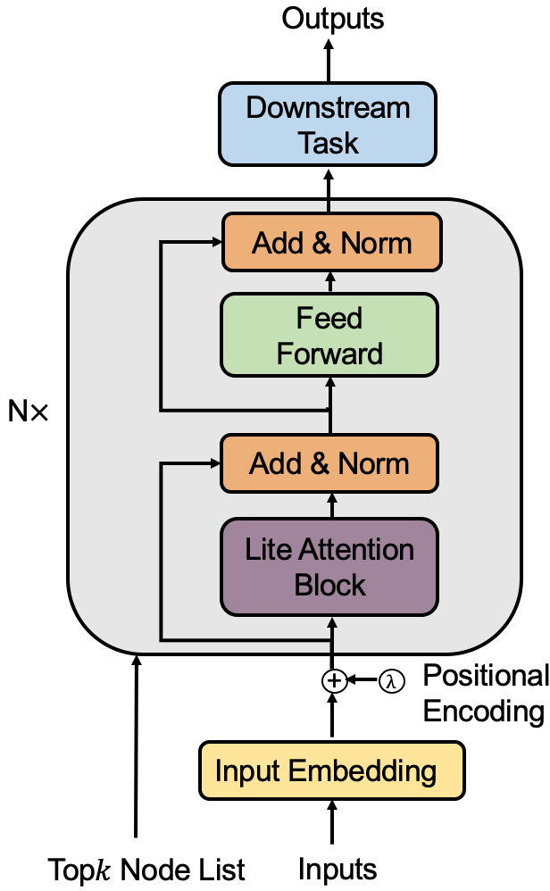
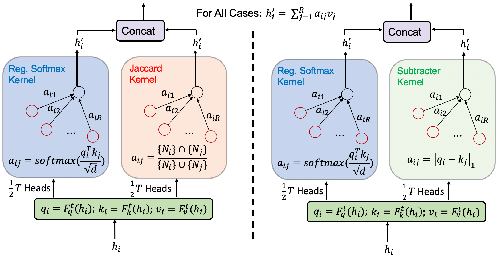

# [CIKM-2021] LiteGT: Efficient and Lightweight Graph Transformers

Source code for the paper "[LiteGT: Efficient and Lightweight Graph Transformers]".

We propose a three-level efficient graph transformer architecture called  **LiteGT** to learn on arbitrary graphs, which saves computation, memory and model size altogether. 

- **Instance-level** A novel Kullback-Leibler divergence-base sampling to consider top-*logN* important nodes for attention value computation
- **Relation-level** Two versions of two-branch attention paradigm that one branch considers sampling nodes with regularized softmax attention, and another branch adopts a lightweight kernel that use subtraction only, or fixed graph-specific Jaccard information.
- **Vector-level** We reduce the hidden dimensions at several block intervals. The pyramid-shape transformer architecture is found to be effective.

Another important property is that our method effectively alleviates the [over-smoothing problem](https://arxiv.org/pdf/1905.10947.pdf) when the layers go deep. Specifically, the nodes are updated with different attention schemes during training, thus avoiding all node features converging to a single representation.

<br>

<p align="center">
   
  <br>
  <b>Figure</b>: Left depicts the proposed LiteGT model. Right shows the two formats of the lite attention block. The two branches of the lite attention block employ different attention kernels. The first branch would always employ regularized softmax-kernel, while the second branch employs either Jaccard or Subtracter kernel.
</p>


## 1. Repo installation

This project is based on the [benchmarking-gnns](https://github.com/graphdeeplearning/benchmarking-gnns) repository.

[Follow these instructions](./docs/01_benchmark_installation.md) to install the benchmark and setup the environment.


<br>

## 2. Download datasets

[Proceed as follows](./docs/02_download_datasets.md) to download the datasets used to evaluate Graph Transformer.

<br>

## 3. Reproducibility 

[Use this page](./docs/03_run_codes.md) to run the codes and reproduce the published results.

<br>


## 4. Citation
```
@article{chen2021litegt,
  title={LiteGT: Efficient and Lightweight Graph Transformers},
  author={Chen Cong, Tao Chaofan, Wong, Ngai},
  journal={The Conference on Information and Knowledge Management (CIKM)},
  year={2021}
}
```


<br>

<br><br><br>